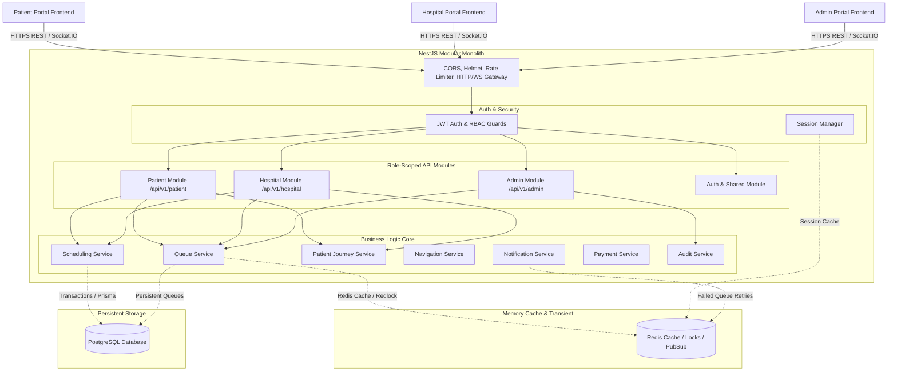
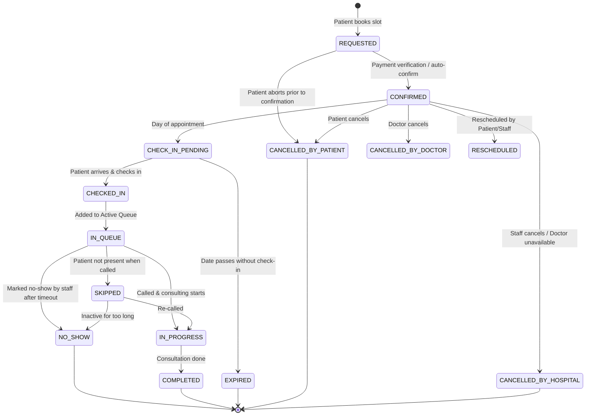
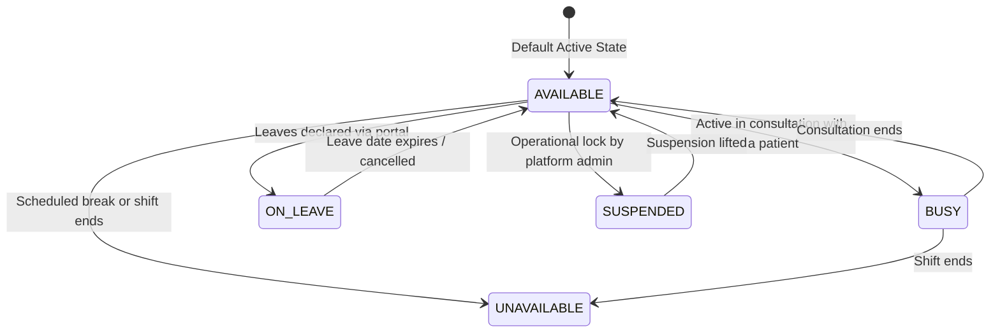

# Shared Backend for Smart Hospital Queue & Navigation System

This document outlines the detailed system design, database architecture, and implementation roadmap for the unified shared backend serving the Patient Portal, Hospital Portal, and Platform Admin Portal.

## User Review Required

> [!IMPORTANT]
> **Single Relational Database Source of Truth**: PostgreSQL serves as the permanent source of truth. Redis will only manage transient data (caching, rate limits, active queue positioning cache, and distributed locks).
> **Role Isolation (Tenant Enforced)**: Security rules are enforced strictly server-side. Multi-tenancy operates at the database level by tying all resources (Admins, Doctors, Staff, Queues, Appointments) to a specific `Hospital` tenant.
> **No Direct Client Infrastructure Access**: Frontend clients must communicate only via REST APIs and authenticated WebSocket rooms. No database/Redis direct connections are permitted.

## Open Questions

> [!NOTE]
> 1. Do we want to support multi-language localizations (i.e. i18n support) in the Notification system on the backend, or should the frontend handle localization of display text while the backend transmits parameters? *(Standard approach: Backend sends keys and template parameters, frontend localized. We will implement this standard)*
> 2. For payment verification, should we assume a mockup integration for Razorpay/Stripe webhooks, or do we have sandbox credentials ready to connect? *(Standard approach: Implement a general mock provider interface that is fully testable locally)*

---

## 1. Architecture Diagram



---

## 2. Complete Module List

The backend application is structured as a **modular monolith** with the following key modules:

1. **`AuthModule`**: Handles user registration, authentication (JWT), token generation/rotation, security check for WebSocket handshakes, and password hashing using Argon2.
2. **`UsersModule`**: Manages the base `User` entity, credentials, roles, and profile linkages.
3. **`HospitalsModule`**: Manages hospitals, operating hours, and closures. Enforces tenant scope.
4. **`DepartmentsModule`**: Organizes departments (e.g. Cardiology, Radiology) nested inside hospitals.
5. **`ServicesModule`**: Manages hospital services (e.g., consultation, lab test) with duration mappings.
6. **`DoctorsModule`**: Tracks doctors, their schedules, and date-specific availability overrides.
7. **`PatientsModule`**: Handles patient registration profiles and history.
8. **`AppointmentsModule`**: Manages the life cycle of appointments, validation, and slot selection.
9. **`QueuesModule`**: Contains the smart queue engine, waiting time calculation, check-in rules, and entry operations.
10. **`PatientJourneyModule`**: Represents the multi-step operational journey of checking-in, consulting, scanning, and final reporting.
11. **`NavigationModule`**: Provides location coordinates, room listings, and indoor instructions for patient journeys.
12. **`PaymentsModule`**: Manages billing, refunds, webhook callbacks, and updates appointment state.
13. **`NotificationsModule`**: Dispatches In-App alerts, SMS, or Emails asynchronously.
14. **`AlertsModule`**: Dispatches notifications for operational exceptions (high queue load, late doctors).
15. **`AnalyticsModule`**: Compiles dashboard metrics, patient throughput, average delays, and utilization.
16. **`AuditModule`**: Maintains chronological log files and DB records of critical state changes.
17. **`RealtimeModule`**: Orchestrates Socket.IO gateways, namespaces, authentication checks, and room joining scopes.
18. **`HealthModule`**: Exposes `/health`, database connectivity, and Redis memory metrics.

---

## 3. Database ERD in Text Form

```text
[User] 1 ---- 0..1 [Patient]
[User] 1 ---- 0..1 [Doctor]
[User] 1 ---- 0..1 [HospitalAdmin]
[User] 1 ---- 0..1 [HospitalStaff]
[User] 1 ---- 0..* [RefreshSession]

[Hospital] 1 ---- 0..* [Department]
[Hospital] 1 ---- 0..* [Service]
[Hospital] 1 ---- 0..* [Doctor]
[Hospital] 1 ---- 0..* [HospitalOperatingHours]
[Hospital] 1 ---- 0..* [HospitalClosure]
[Hospital] 1 ---- 0..* [Appointment]
[Hospital] 1 ---- 0..* [Queue]
[Hospital] 1 ---- 0..* [AuditLog]
[Hospital] 1 ---- 0..* [Alert]

[Department] 1 ---- 0..* [DoctorDepartment] (Junction table)
[Department] 1 ---- 0..* [Appointment]
[Department] 1 ---- 0..* [Queue]

[Doctor] 1 ---- 0..* [DoctorDepartment]
[Doctor] 1 ---- 0..* [DoctorAvailability] (Weekly template)
[Doctor] 1 ---- 0..* [DoctorOverride] (Date overrides)
[Doctor] 1 ---- 0..* [Appointment]
[Doctor] 1 ---- 0..* [Queue]

[Patient] 1 ---- 0..* [Appointment]
[Patient] 1 ---- 0..* [QueueEntry]
[Patient] 1 ---- 0..* [PatientJourney]

[Appointment] 1 ---- 0..1 [QueueEntry]
[Appointment] 1 ---- 0..1 [PatientJourney]
[Appointment] 1 ---- 0..1 [Payment]
[Appointment] 1 ---- 0..* [AppointmentStatusHistory]

[Queue] 1 ---- 0..* [QueueEntry]

[QueueEntry] 1 ---- 0..* [QueueEvent]

[PatientJourney] 1 ---- 1..* [JourneyStep]
```

---

## 4. Complete Entity Relationship Explanation

- **Base User vs. Role-Scoped Profiles**: A single `User` table holds the credentials (`email`, `phone`, `passwordHash`) and permissions (`role`). It acts as a supertype with a 1:1 relationship to sub-profiles (`Patient`, `Doctor`, `HospitalAdmin`, `HospitalStaff`). This guarantees that login credentials are unified.
- **Tenant Scoping (Hospitals)**: The `Hospital` is the root tenant. `Department`, `Service`, `Doctor`, `Appointment`, and `Queue` contain a direct reference to a `Hospital` (`hospitalId`). All queries run by staff must filter by `hospitalId` stored in the staff's session.
- **Doctor Specializations & Availability**: Doctors can be linked to multiple departments via the `DoctorDepartment` junction. Their weekly recurring schedules are stored in `DoctorAvailability`, whereas anomalies (holidays, urgent leave) are stored in `DoctorOverride` to take precedence during slot generation.
- **Appointments to Queues**: An `Appointment` maps a `Patient`, `Doctor`, `Department`, `Service`, and a date/time window. Once checked-in, an appointment automatically spins up a corresponding `QueueEntry` inside the current day's active `Queue`.
- **Journeys & Navigation**: A `PatientJourney` tracks the operational roadmap of an appointment (e.g. OP Counter -> Vitals -> Doctor Room -> Lab -> Pharmacy). Each milestone corresponds to a `JourneyStep` containing specific `NavigationRoute` instructions.
- **Payment & Audit Traceability**: `Payment` is tied 1:1 to `Appointment`. All transactions and appointment status changes log records to `AuditLog` (which has a generic `actorUserId` and JSON payload) and `AppointmentStatusHistory`.

---

## 5. Prisma Schema Design

This is the blueprint for our `prisma/schema.prisma` file:

```prisma
datasource db {
  provider = "postgresql"
  url      = env("DATABASE_URL")
}

generator client {
  provider = "prisma-client-js"
}

enum Role {
  PATIENT
  DOCTOR
  HOSPITAL_STAFF
  HOSPITAL_ADMIN
  PLATFORM_ADMIN
}

enum UserStatus {
  ACTIVE
  INACTIVE
  SUSPENDED
}

model User {
  id            String         @id @default(uuid())
  email         String?        @unique
  phone         String?        @unique
  passwordHash  String
  role          Role
  status        UserStatus     @default(ACTIVE)
  createdAt     DateTime       @default(now())
  updatedAt     DateTime       @updatedAt
  lastLoginAt   DateTime?

  patientProfile  Patient?
  doctorProfile   Doctor?
  adminProfile    HospitalAdmin?
  staffProfile    HospitalStaff?
  sessions        RefreshSession[]
  auditLogs       AuditLog[]
}

model RefreshSession {
  id                 String   @id @default(uuid())
  userId             String
  user               User     @relation(fields: [userId], references: [id], onDelete: Cascade)
  refreshTokenHash   String   @unique
  deviceFingerprint  String?
  ipAddress          String?
  expiresAt          DateTime
  isValid            Boolean  @default(true)
  createdAt          DateTime @default(now())
  updatedAt          DateTime @updatedAt
}

model Patient {
  id           String        @id @default(uuid())
  userId       String        @unique
  user         User          @relation(fields: [userId], references: [id], onDelete: Cascade)
  fullName     String
  dateOfBirth  DateTime
  gender       String
  address      String?
  createdAt    DateTime      @default(now())
  updatedAt    DateTime      @updatedAt

  appointments Appointment[]
  queueEntries QueueEntry[]
  journeys     PatientJourney[]
}

enum HospitalStatus {
  ACTIVE
  INACTIVE
  SUSPENDED
  TEMPORARILY_CLOSED
}

model Hospital {
  id            String         @id @default(uuid())
  name          String
  code          String         @unique
  address       String
  contactNumber String
  email         String
  timezone      String         @default("UTC")
  status        HospitalStatus @default(ACTIVE)
  createdAt     DateTime       @default(now())
  updatedAt     DateTime       @updatedAt

  operatingHours  HospitalOperatingHours[]
  closures        HospitalClosure[]
  departments     Department[]
  services        Service[]
  doctors         Doctor[]
  admins          HospitalAdmin[]
  staff           HospitalStaff[]
  appointments    Appointment[]
  queues          Queue[]
  alerts          Alert[]
  auditLogs       AuditLog[]
}

model HospitalOperatingHours {
  id         String   @id @default(uuid())
  hospitalId String
  hospital   Hospital @relation(fields: [hospitalId], references: [id], onDelete: Cascade)
  dayOfWeek  Int      // 0 = Sunday, 6 = Saturday
  openTime   String   // HH:MM format
  closeTime  String   // HH:MM format

  @@unique([hospitalId, dayOfWeek])
}

enum ClosureType {
  HOLIDAY
  MAINTENANCE
  EMERGENCY_CLOSURE
  DEPARTMENT_CLOSURE
  SERVICE_SUSPENSION
}

model HospitalClosure {
  id         String      @id @default(uuid())
  hospitalId String
  hospital   Hospital    @relation(fields: [hospitalId], references: [id], onDelete: Cascade)
  startDate  DateTime
  endDate    DateTime
  reason     String
  type       ClosureType
  createdAt  DateTime    @default(now())
  updatedAt  DateTime    @updatedAt
}

model HospitalAdmin {
  id         String   @id @default(uuid())
  userId     String   @unique
  user       User     @relation(fields: [userId], references: [id], onDelete: Cascade)
  hospitalId String
  hospital   Hospital @relation(fields: [hospitalId], references: [id], onDelete: Cascade)
  fullName   String
  createdAt  DateTime @default(now())
  updatedAt  DateTime @updatedAt
}

model HospitalStaff {
  id         String   @id @default(uuid())
  userId     String   @unique
  user       User     @relation(fields: [userId], references: [id], onDelete: Cascade)
  hospitalId String
  hospital   Hospital @relation(fields: [hospitalId], references: [id], onDelete: Cascade)
  fullName   String
  createdAt  DateTime @default(now())
  updatedAt  DateTime @updatedAt
}

enum EntityStatus {
  ACTIVE
  INACTIVE
}

model Department {
  id          String       @id @default(uuid())
  hospitalId  String
  hospital    Hospital     @relation(fields: [hospitalId], references: [id], onDelete: Cascade)
  name        String
  code        String
  description String?
  location    String?      // Location inside building (e.g. Block B, Floor 2)
  status      EntityStatus @default(ACTIVE)
  createdAt   DateTime     @default(now())
  updatedAt   DateTime     @updatedAt

  doctors      DoctorDepartment[]
  appointments Appointment[]
  queues       Queue[]

  @@unique([hospitalId, code])
}

model Service {
  id                       String       @id @default(uuid())
  hospitalId               String
  hospital                 Hospital     @relation(fields: [hospitalId], references: [id], onDelete: Cascade)
  name                     String
  code                     String
  description              String?
  estimatedDurationMinutes Int          @default(15)
  status                   EntityStatus @default(ACTIVE)
  createdAt                DateTime     @default(now())
  updatedAt                DateTime     @updatedAt

  appointments Appointment[]
  queueEntries QueueEntry[]

  @@unique([hospitalId, code])
}

enum DoctorStatus {
  AVAILABLE
  BUSY
  UNAVAILABLE
  ON_LEAVE
  SUSPENDED
}

model Doctor {
  id             String             @id @default(uuid())
  userId         String             @unique
  user           User               @relation(fields: [userId], references: [id], onDelete: Cascade)
  hospitalId     String
  hospital       Hospital           @relation(fields: [hospitalId], references: [id], onDelete: Cascade)
  fullName       String
  specialization String
  status         DoctorStatus       @default(AVAILABLE)
  createdAt      DateTime           @default(now())
  updatedAt      DateTime           @updatedAt

  departments   DoctorDepartment[]
  availability  DoctorAvailability[]
  overrides     DoctorOverride[]
  appointments  Appointment[]
  queues        Queue[]
}

model DoctorDepartment {
  doctorId     String
  doctor       Doctor     @relation(fields: [doctorId], references: [id], onDelete: Cascade)
  departmentId String
  department   Department @relation(fields: [departmentId], references: [id], onDelete: Cascade)

  @@id([doctorId, departmentId])
}

model DoctorAvailability {
  id         String   @id @default(uuid())
  doctorId   String
  doctor     Doctor   @relation(fields: [doctorId], references: [id], onDelete: Cascade)
  dayOfWeek  Int      // 0 = Sunday, 6 = Saturday
  startTime  String   // HH:MM
  endTime    String   // HH:MM

  @@unique([doctorId, dayOfWeek])
}

model DoctorOverride {
  id          String   @id @default(uuid())
  doctorId    String
  doctor      Doctor   @relation(fields: [doctorId], references: [id], onDelete: Cascade)
  date        DateTime // Date of override
  startTime   String?  // HH:MM
  endTime     String?  // HH:MM
  isAvailable Boolean  @default(false)
  reason      String?
}

enum AppointmentStatus {
  REQUESTED
  PENDING_CONFIRMATION
  CONFIRMED
  CHECK_IN_PENDING
  CHECKED_IN
  IN_QUEUE
  IN_PROGRESS
  COMPLETED
  CANCELLED_BY_PATIENT
  CANCELLED_BY_HOSPITAL
  CANCELLED_BY_DOCTOR
  RESCHEDULED
  NO_SHOW
  EXPIRED
}

model Appointment {
  id                 String            @id @default(uuid())
  patientId          String
  patient            Patient           @relation(fields: [patientId], references: [id], onDelete: Cascade)
  hospitalId         String
  hospital           Hospital          @relation(fields: [hospitalId], references: [id], onDelete: Cascade)
  departmentId       String
  department         Department        @relation(fields: [departmentId], references: [id], onDelete: Cascade)
  doctorId           String
  doctor             Doctor            @relation(fields: [doctorId], references: [id], onDelete: Cascade)
  serviceId          String
  service            Service           @relation(fields: [serviceId], references: [id], onDelete: Cascade)
  appointmentDate    DateTime
  timeWindowStart    DateTime
  timeWindowEnd      DateTime
  status             AppointmentStatus @default(CONFIRMED)
  createdAt          DateTime          @default(now())
  updatedAt          DateTime          @updatedAt

  queueEntry   QueueEntry?
  journey      PatientJourney?
  payment      Payment?
  history      AppointmentStatusHistory[]

  @@index([hospitalId, appointmentDate])
  @@index([doctorId, appointmentDate])
  @@index([patientId])
}

model AppointmentStatusHistory {
  id            String            @id @default(uuid())
  appointmentId String
  appointment   Appointment       @relation(fields: [appointmentId], references: [id], onDelete: Cascade)
  fromStatus    AppointmentStatus
  toStatus      AppointmentStatus
  changedByUserId String
  changedAt     DateTime          @default(now())
  reason        String?
}

enum QueueStatus {
  ACTIVE
  PAUSED
  CLOSED
}

model Queue {
  id           String      @id @default(uuid())
  hospitalId   String
  hospital     Hospital    @relation(fields: [hospitalId], references: [id], onDelete: Cascade)
  departmentId String
  department   Department  @relation(fields: [departmentId], references: [id], onDelete: Cascade)
  doctorId     String
  doctor       Doctor      @relation(fields: [doctorId], references: [id], onDelete: Cascade)
  date         DateTime
  status       QueueStatus @default(ACTIVE)
  createdAt    DateTime    @default(now())
  updatedAt    DateTime    @updatedAt

  entries QueueEntry[]

  @@unique([doctorId, date])
}

enum QueueEntryStatus {
  WAITING
  CALLED
  IN_PROGRESS
  COMPLETED
  SKIPPED
  NO_SHOW
  TRANSFERRED
  CANCELLED
}

model QueueEntry {
  id                       String           @id @default(uuid())
  queueId                  String
  queue                    Queue            @relation(fields: [queueId], references: [id], onDelete: Cascade)
  appointmentId            String           @unique
  appointment              Appointment      @relation(fields: [appointmentId], references: [id], onDelete: Cascade)
  patientId                String
  patient                  Patient          @relation(fields: [patientId], references: [id], onDelete: Cascade)
  serviceId                String
  service                  Service          @relation(fields: [serviceId], references: [id], onDelete: Cascade)
  priority                 Int              @default(0) // Default priority is 0
  estimatedDurationMinutes Int
  position                 Int
  estimatedStartTime       DateTime
  estimatedEndTime         DateTime
  recommendedArrivalTime   DateTime
  status                   QueueEntryStatus @default(WAITING)
  createdAt                DateTime         @default(now())
  updatedAt                DateTime         @updatedAt

  queueEvents QueueEvent[]

  @@index([queueId, position])
}

enum QueueEventType {
  PATIENT_CHECKED_IN
  PATIENT_CALLED
  PATIENT_STARTED
  PATIENT_COMPLETED
  PATIENT_SKIPPED
  PATIENT_MARKED_NO_SHOW
  QUEUE_REORDERED
  DOCTOR_UNAVAILABLE
  WAIT_TIME_RECALCULATED
}

model QueueEvent {
  id              String         @id @default(uuid())
  queueEntryId    String
  queueEntry      QueueEntry     @relation(fields: [queueEntryId], references: [id], onDelete: Cascade)
  type            QueueEventType
  payload         Json?
  triggeredByUserId String
  createdAt       DateTime       @default(now())
}

enum JourneyStatus {
  PENDING
  IN_PROGRESS
  COMPLETED
  CANCELLED
}

model PatientJourney {
  id            String        @id @default(uuid())
  appointmentId String        @unique
  appointment   Appointment   @relation(fields: [appointmentId], references: [id], onDelete: Cascade)
  patientId     String
  patient       Patient       @relation(fields: [patientId], references: [id], onDelete: Cascade)
  status        JourneyStatus @default(PENDING)
  createdAt     DateTime      @default(now())
  updatedAt     DateTime      @updatedAt

  steps JourneyStep[]
}

enum StepStatus {
  PENDING
  READY
  IN_PROGRESS
  COMPLETED
  SKIPPED
  CANCELLED
}

model JourneyStep {
  id                       String         @id @default(uuid())
  journeyId                String
  journey                  PatientJourney @relation(fields: [journeyId], references: [id], onDelete: Cascade)
  stepName                 String
  orderIndex               Int
  status                   StepStatus     @default(PENDING)
  location                 String
  instruction              String
  estimatedDurationMinutes Int            @default(15)
  actualStartTime          DateTime?
  actualEndTime            DateTime?
  createdAt                DateTime       @default(now())
  updatedAt                DateTime       @updatedAt
}

model NavigationRoute {
  id          String   @id @default(uuid())
  hospitalId  String
  name        String
  description String?
  steps       Json     // Array of navigation steps and checkpoints
  status      EntityStatus @default(ACTIVE)
  createdAt   DateTime @default(now())
  updatedAt   DateTime @updatedAt
}

enum PaymentStatus {
  PENDING
  PROCESSING
  SUCCESS
  FAILED
  REFUNDED
  CANCELLED
}

model Payment {
  id                    String        @id @default(uuid())
  appointmentId         String        @unique
  appointment           Appointment   @relation(fields: [appointmentId], references: [id], onDelete: Cascade)
  amount                Decimal       @db.Decimal(10, 2)
  currency              String        @default("INR")
  provider              String        // stripe, razorpay, cash, etc.
  providerTransactionId String?       @unique
  status                PaymentStatus @default(PENDING)
  metadata              Json?
  createdAt             DateTime      @default(now())
  updatedAt             DateTime      @updatedAt
}

enum NotificationChannel {
  IN_APP
  SMS
  EMAIL
}

enum NotificationStatus {
  PENDING
  SENT
  DELIVERED
  FAILED
  RETRYING
}

model Notification {
  id           String              @id @default(uuid())
  patientId    String
  title        String
  message      String
  channel      NotificationChannel
  status       NotificationStatus  @default(PENDING)
  retryCount   Int                 @default(0)
  nextRetryAt  DateTime?
  errorLog     String?
  createdAt    DateTime            @default(now())
  updatedAt    DateTime            @updatedAt
}

enum AlertType {
  HIGH_QUEUE_LOAD
  DOCTOR_UNAVAILABLE
  DEPARTMENT_OVERLOAD
  HOSPITAL_CLOSURE
  LARGE_WAITING_TIME
  NOTIFICATION_FAILURE
  SYSTEM_ISSUE
}

enum AlertStatus {
  OPEN
  ACKNOWLEDGED
  RESOLVED
}

model Alert {
  id         String      @id @default(uuid())
  hospitalId String
  hospital   Hospital    @relation(fields: [hospitalId], references: [id], onDelete: Cascade)
  type       AlertType
  message    String
  status     AlertStatus @default(OPEN)
  createdAt  DateTime    @default(now())
  updatedAt  DateTime    @updatedAt
}

model AuditLog {
  id                 String   @id @default(uuid())
  actorUserId        String?
  actor              User?    @relation(fields: [actorUserId], references: [id])
  actorRole          Role?
  hospitalId         String?
  hospital           Hospital? @relation(fields: [hospitalId], references: [id])
  action             String
  resourceType       String
  resourceIdentifier String
  status             String
  timestamp          DateTime @default(now())
  metadata           Json?
}
```

---

## 6. Authentication Architecture

```text
               User Creds
Patient   ───────────────────►   [POST /api/v1/auth/login]
Hospital                         Verify credentials (argon2)
Admin                            Generate Session Context
                                         │
                                         ▼
                               [Create Tokens Pair]
                     Access Token                Refresh Token
                  (short-lived, 15m)          (long-lived, 7 days)
                  Payload: user ID,           Stored in DB (hashed) &
                  role, tenant context        returned as HttpOnly Cookie
                                         │
                                         ▼
                     All API requests must carry Access Token
                     in Authorization header: Bearer <JWT>
```

- **Token Expiry**:
  - `AccessToken`: Expiry 15 minutes. Payload contains: `userId`, `role`, `hospitalId` (if hospital worker), `patientId` (if patient).
  - `RefreshToken`: Expiry 7 days. Stored as an `HttpOnly`, secure, `SameSite=Strict` cookie to resist CSRF.
- **Session Revocation**:
  - Stored in the `RefreshSession` table.
  - Upon user logout or role modification, valid sessions are deleted/invalidated.
  - Token rotation is applied: every `/auth/refresh` request issues a new Refresh Token and invalidates the previous one.
- **MFA Architecture**:
  - `User` record can flag `mfaEnabled: Boolean` and `mfaSecret: String` (TOTP).
  - Privileged paths trigger 2FA check endpoints returning temporary `MFA_PENDING` tokens.

---

## 7. RBAC Matrix

| Feature / Resource | Patient | Doctor | Hospital Staff | Hospital Admin | Platform Admin |
| :--- | :---: | :---: | :---: | :---: | :---: |
| **Hospitals (Add/Modify)** | ❌ | ❌ | ❌ | ❌ | **YES** |
| **Departments / Services (Manage)** | ❌ | ❌ | ❌ | **YES** (Own) | **YES** (Global) |
| **Doctor Availability (Regular/Override)** | ❌ | **YES** (Self) | **YES** (Own Hosp) | **YES** (Own Hosp) | **YES** |
| **Book Appointment** | **YES** (Self) | ❌ | **YES** (Hosp Pat) | **YES** (Hosp Pat) | ❌ |
| **Patient Check-In** | **YES** (Self) | ❌ | **YES** (Hosp Pat) | **YES** (Hosp Pat) | ❌ |
| **Call Next Patient** | ❌ | **YES** (Self) | **YES** (Hosp Dept)| **YES** (Hosp) | ❌ |
| **Skip / Complete Queue Entry** | ❌ | **YES** (Self) | **YES** (Hosp Dept)| **YES** (Hosp) | ❌ |
| **View Audit Logs** | ❌ | ❌ | ❌ | **YES** (Own Hosp) | **YES** (Global) |
| **Platform Monitoring / Analytics** | ❌ | ❌ | ❌ | **YES** (Own Hosp) | **YES** (Global) |

---

## 8. API Endpoint Catalogue

### Auth (`/api/v1/auth`)
- `POST /register`: Registers a new patient.
- `POST /login`: Standard credential check, returns access token + sets HTTP-only refresh cookie.
- `POST /refresh`: Verifies rotation of refresh token, returns new token set.
- `POST /logout`: Invalidates session token in DB/Redis.
- `POST /forgot-password` & `POST /reset-password`: Reset mechanisms.

### Patient API Module (`/api/v1/patient`)
- `GET /profile` & `PATCH /profile`: Edit demographics.
- `GET /hospitals`: List active hospitals with search/filter.
- `GET /hospitals/:id`: Detail view of specific hospital (departments, services).
- `GET /doctors` & `GET /services`: Search directory.
- `GET /appointments`: List patient's bookings (paginated).
- `POST /appointments`: Book new slot (uses transaction check).
- `GET /appointments/:id`: Booking details.
- `POST /appointments/:id/cancel` & `POST /appointments/:id/reschedule`: Manage slot.
- `POST /appointments/:id/check-in`: Trigger check-in (requires validation of time window & geography).
- `GET /queue`: Get patient's current position and estimated delay.
- `GET /journey`: Active milestone check.
- `GET /navigation`: Active waypoint guidance.

### Hospital API Module (`/api/v1/hospital`)
- `GET /dashboard`: Daily queue count, waiting metrics, alerts.
- `GET /patients`: List patients (paginated, search).
- `GET /doctors` & `GET /departments` & `GET /services`: Settings lists.
- `GET /appointments`: Central list of hospital appointments (filter by dept/doctor/date).
- `PATCH /appointments/:id`: Reschedule or correct status.
- `GET /queues` & `GET /queues/:id`: Active queue list details.
- `POST /queues/:id/call-next`: Alert next patient to room (triggers WebSocket push).
- `POST /queue-entries/:id/skip`: Tag patient late/skip position.
- `POST /queue-entries/:id/start` & `POST /queue-entries/:id/complete`: Progress consulting window.
- `GET /doctors/:id/availability` & `PATCH /doctors/:id/availability`: Manage schedule.
- `POST /doctor-unavailability`: Declare sudden leave (reschedules affected slots).
- `GET /analytics`: Detailed tenant reports.
- `GET /alerts`: Incident register.

### Admin API Module (`/api/v1/admin`)
- `GET /dashboard`: High-level network summary.
- `GET /hospitals` & `POST /hospitals` & `PATCH /hospitals/:id`: Administer hospital listings.
- `GET /hospital-admins` & `POST /hospital-admins` & `PATCH /hospital-admins/:id`: Administer tenant admins.
- `GET /doctors` & `GET /patients` & `GET /appointments` & `GET /queues`: Universal read-only data query with strict scoping.
- `GET /live-monitor`: Network load statistics.
- `GET /audit-logs`: Multi-criteria search trace for operational changes.

---

## 9. Queue Engine Design

The queue engine coordinates scheduling and actual waiting times dynamically. It relies on a deterministic queue model.

### 9.1 Slot Generation Flow (Booking Check)
1. **Inputs**: `doctorId`, `date`, `serviceId`.
2. **Step 1**: Retrieve `DoctorAvailability` (weekly schedule) for the given day of the week.
3. **Step 2**: Retrieve any `DoctorOverride` for the specific date. Overrides override weekly rules completely.
4. **Step 3**: Retrieve `HospitalClosure` and `Department` status to ensure they are open.
5. **Step 4**: Query existing `Appointment` slots for that doctor on the date.
6. **Step 5**: Compute open windows based on `Service.estimatedDurationMinutes`.
7. **Step 6**: Execute atomic check-and-insert using **PostgreSQL Database Transactions** (`SELECT ... FOR UPDATE` on doctor schedule/appointments) to block double bookings.

### 9.2 Wait Time Estimation Flow (Active Queue)
The system calculates estimates instead of strict schedules because real-life consultations fluctuate:
$$\text{Est. Wait Time} = (\text{Active Entries in Front} \times \text{Average Service Duration}) + \text{Accumulated Delay}$$

- **Factors**:
  - `WAITING` entries ahead in the queue sequence.
  - Estimated duration of the target patient's service.
  - Doctor's actual consultation speed (calculated in Redis using moving averages: `doctor:avg_duration` calculated from the last 5 completed entries).
- **Anti-Starvation**:
  - Operational priority values can be set by clinic staff (e.g., triage triage index `1` to `3`).
  - To prevent lower-priority patients from being pushed back infinitely, the queue calculation adds an aging factor:
    $$\text{Effective Priority} = \text{Base Priority} + \left( \frac{\text{Wait Time In Minutes}}{15} \right)$$
    This ensures that over time, long-waiting patients naturally climb the priority index.

### 9.3 Atomic Booking Concurrency Safety
To prevent two patients from claiming the final appointment slot:
```sql
-- Done via Prisma Interactive Transactions:
BEGIN TRANSACTION;
  -- Lock doctor's bookings for the specific day to prevent concurrent writes
  SELECT * FROM "Appointment" 
  WHERE "doctorId" = 'doc-uuid' AND "appointmentDate" = '2026-08-26' 
  FOR UPDATE;

  -- Validate slot availability
  -- [Validation checks...]

  -- If valid, write appointment
  INSERT INTO "Appointment" (...);
COMMIT;
```

---

## 10. Appointment State Machine



---

## 11. Doctor Availability State Machine



---

## 12. WebSocket Event Catalogue

All events use authentication verification. Connections require a JWT token in the connection handshake query. Users are joined to scoped rooms on connection:
- Platform Admins: `admin` room.
- Hospital Admins/Staff: `hospital:{hospitalId}` room.
- Doctors: `doctor:{doctorId}` room.
- Patients: `patient:{patientId}` room.

| Event Name | Namespace | Target Room | Payload | Description |
| :--- | :--- | :--- | :--- | :--- |
| **`queue.updated`** | `/queue` | `hospital:{id}` | `{ queueId, doctorId, date, waitingCount, lastUpdatedAt }` | Emitted when queue positions recalculate. |
| **`queue.patient_called`** | `/queue` | `patient:{id}` | `{ queueEntryId, doctorName, roomNumber, estimatedStartTime }` | Alerts a specific patient to proceed to the consultation room. |
| **`queue.wait_time_updated`** | `/queue` | `patient:{id}` | `{ queueEntryId, position, estimatedStartTime, recommendedArrivalTime }` | Live updates estimated delays. |
| **`doctor.status_changed`** | `/hospital`| `hospital:{id}` | `{ doctorId, status }` | Broadcasts doctor availability updates. |
| **`appointment.updated`** | `/appt` | `patient:{id}` | `{ appointmentId, status, timeWindowStart }` | Notifies patient of changes to their appointment (e.g. rescheduled). |
| **`alert.created`** | `/alerts` | `hospital:{id}` | `{ alertId, type, message, severity }` | Pushes active warnings to staff monitors. |
| **`journey.updated`** | `/journey` | `patient:{id}` | `{ journeyId, currentStepIndex, status, nextInstruction }` | Live updates active milestones for patient navigation. |

---

## 13. Folder Structure

We organize our codebase using NestJS module separation guidelines:

```text
src/
├── main.ts
├── app.module.ts
│
├── config/
│   ├── configuration.ts          # Typed configuration objects
│   └── validation.schema.ts     # class-validator schemas for env variables
│
├── common/
│   ├── decorators/
│   │   ├── roles.decorator.ts
│   │   └── user.decorator.ts
│   ├── guards/
│   │   ├── jwt-auth.guard.ts
│   │   └── rbac.guard.ts
│   ├── interceptors/
│   │   ├── transform.interceptor.ts
│   │   └── logging.interceptor.ts
│   ├── filters/
│   │   └── http-exception.filter.ts
│   ├── pipes/
│   │   └── validation.pipe.ts
│   ├── middleware/
│   │   └── request-id.middleware.ts
│   └── constants/
│
├── auth/
│   ├── auth.module.ts
│   ├── auth.controller.ts
│   ├── auth.service.ts
│   ├── strategies/
│   │   └── jwt.strategy.ts
│   └── dto/
│
├── users/
│   ├── users.module.ts
│   └── users.service.ts
│
├── hospitals/
│   ├── hospitals.module.ts
│   ├── hospitals.controller.ts
│   └── hospitals.service.ts
│
├── departments/
├── services/
├── doctors/
├── patients/
│
├── appointments/
│   ├── appointments.module.ts
│   ├── appointments.controller.ts
│   └── appointments.service.ts
│
├── queues/
│   ├── queues.module.ts
│   ├── queues.controller.ts
│   ├── queues.service.ts
│   ├── services/
│   │   ├── queue-engine.service.ts
│   │   └── queue-recalc.service.ts
│   └── dto/
│
├── patient-journey/
├── navigation/
├── payments/
├── notifications/
├── alerts/
├── analytics/
├── audit/
├── realtime/
│   ├── realtime.module.ts
│   ├── realtime.gateway.ts       # Main Socket.IO gateway
│   └── socket-state/
│
└── health/
```

---

## 14. Dependency Map

To maintain a clean modular architecture and avoid circular dependencies:

```text
  [AuthModule] ──► [UsersModule]
  [HospitalsModule] ◄── [DepartmentsModule] ◄── [ServicesModule]
  [DoctorsModule] ──► [HospitalsModule] & [DepartmentsModule]
  
  [AppointmentsModule] 
     ├──► [PatientsModule] & [DoctorsModule] & [ServicesModule]
     └──► [PaymentsModule] (Billing check)
     
  [QueuesModule]
     ├──► [AppointmentsModule] (Status check)
     ├──► [RealtimeModule] (Push events)
     └──► [RedisModule] (Distributed Lock / Speed cache)
     
  [PatientJourneyModule] ──► [AppointmentsModule] & [NavigationModule]
  
  [RealtimeModule] ──► [AuthModule] (Verifies WebSocket Handshake JWT)
  [AuditModule] ◄── [All Modules via AuditInterceptor / Event Emitters]
```

*Circular dependencies will be avoided by using generic `EventEmitter2` notifications for cross-module side effects (e.g. emitting an audit log or notification dispatch when booking completes).*

---

## 15. Development Phases

- **Phase 1: Foundation Setup**: NestJS setup, configuration validation, Docker integration (PostgreSQL + Redis), Prisma initialization, health checks, Swagger setup.
- **Phase 2: Identity & Security**: User model, Bcrypt, JWT auth token logic, session registry, Roles guard.
- **Phase 3: Core Directory Models**: Hospitals, operating hours, closures, departments, services, doctors availability, overrides.
- **Phase 4: Appointment Scheduling**: Booking core, transaction blocks, double-booking checks, cancel/reschedule.
- **Phase 5: Queue Engine & Check-in**: Waiting estimation calculation, priority queues, anti-starvation rules, check-in flow, late handling.
- **Phase 6: Exceptions & Alternatives**: Doctor absence triggers, bulk reschedule, notifications dispatch interface.
- **Phase 7: Patient Journey & Nav**: Journey steps flow, navigation waypoints mapping.
- **Phase 8: WebSocket Realtime Hub**: WebSocket gateway, room segmentation, Redis PubSub event distribution.
- **Phase 9: Billing & Insights**: Payment callbacks, mock gateway, audit logs table, analytics compiler.
- **Phase 10: Security Hardening & Deploy**: Helmet, rate-limiter, integration tests, deploy-ready configs.

---

## 16. Testing Strategy

### 16.1 Testing Framework
- **Unit Testing**: Jest for testing services, validation rules, state machines, and calculations (e.g., wait estimation).
- **Integration Testing**: Supertest for REST endpoint flows and checking RBAC constraints.
- **WebSocket Testing**: Socket.io-client to verify authentication checks and room join commands.

### 16.2 Critical Scenarios Testing Plan

1. **Double Booking Prevention**: Spin up 5 concurrent requests in parallel (using `Promise.all` calling `POST /api/v1/patient/appointments` for the exact same slot). Assert that exactly 1 returns status code 201 (Created) and 4 return status code 409 (Conflict - Slot Unavailable).
2. **Tenant Scoping Guard**: Authenticate as `HOSPITAL_ADMIN` for Hospital A. Send a request to `GET /api/v1/hospital/queues/hospital-B-queue-id`. Assert that the backend returns 403 Forbidden.
3. **Doctor Sudden Absence Rescheduling**: Set a doctor to `UNAVAILABLE` for a future date. Call `POST /api/v1/hospital/doctor-unavailability`. Assert that:
   - Affected appointments' status changes to `PENDING_CONFIRMATION` or `RESCHEDULED`.
   - Notification records are queued for the affected patient profiles.
   - AuditLog record is written with type `DOCTOR_UNAVAILABLE`.
4. **Network Booking Retry (Idempotency)**: Make two calls to `POST /api/v1/patient/appointments` carrying an identical `x-idempotency-key` header in immediate succession. Assert that the second call returns the same resource created by the first call without writing a duplicate record to the DB.
5. **WebSocket Unauthorized Room Subscription**: Connect a client authenticated as Patient A to `/queue`. Try to join the room `patient:patient-B-id`. Assert that the gateway rejects the subscription request or disconnects the socket.

---

## Verification Plan

### Automated Tests
Once the codebase is established:
```bash
# Run all unit tests
npm run test

# Run all integration/e2e tests
npm run test:e2e
```

### Manual Verification
- Spinning up Docker Compose locally and checking connections via Swagger UI (`http://localhost:3000/api/docs`).
- Using postman/websocat to establish authenticated Socket.IO connections and confirm event broadcasts when queue state changes.
